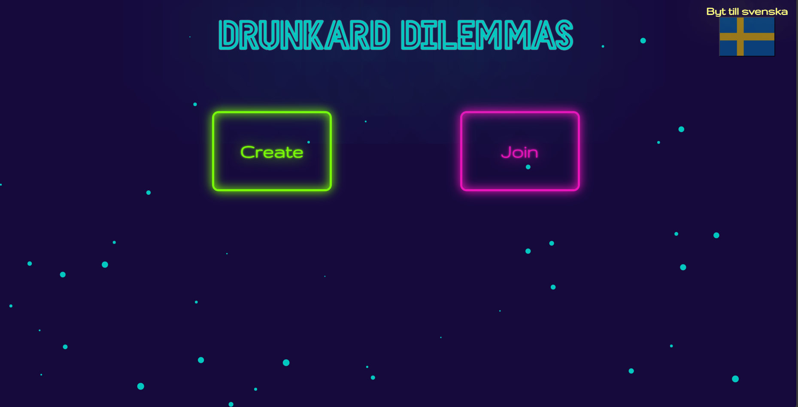

# Drunkard Dilemmas

This website is a multiplayer drinking game made as a part of a course for interface programming.
This game works using sockets and was made in Vue.js and supports cross-platform functionality.

The instructions on how to play the game are available on the game's website but unfortunately, it has not been hosted yet. So to give an example of how the overall game looks, here are some screenshots.

